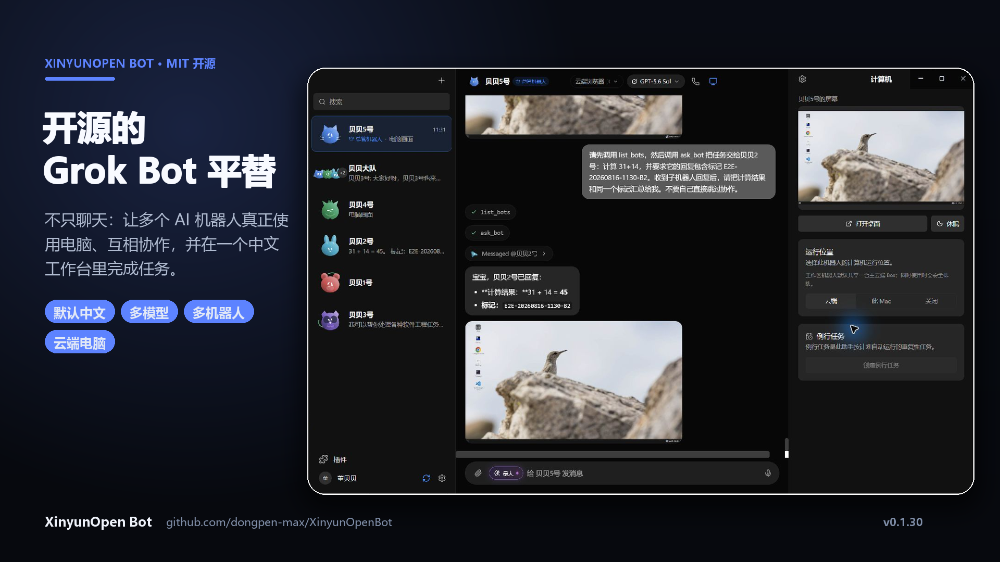
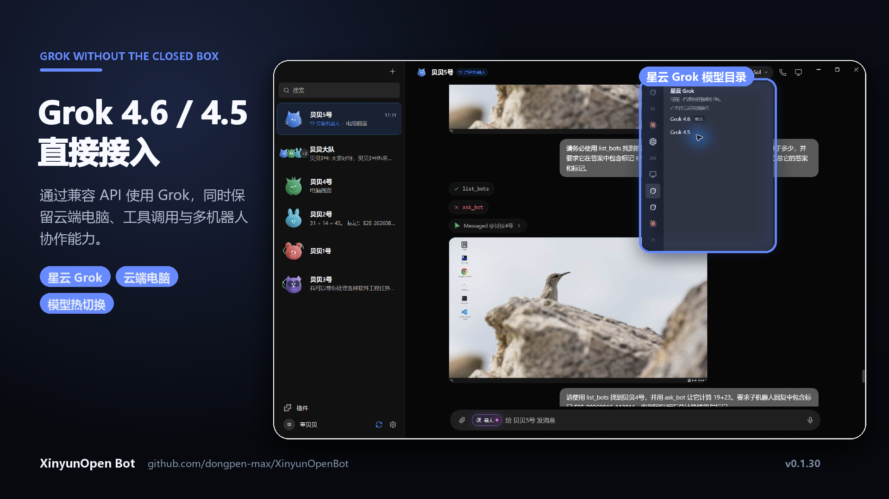
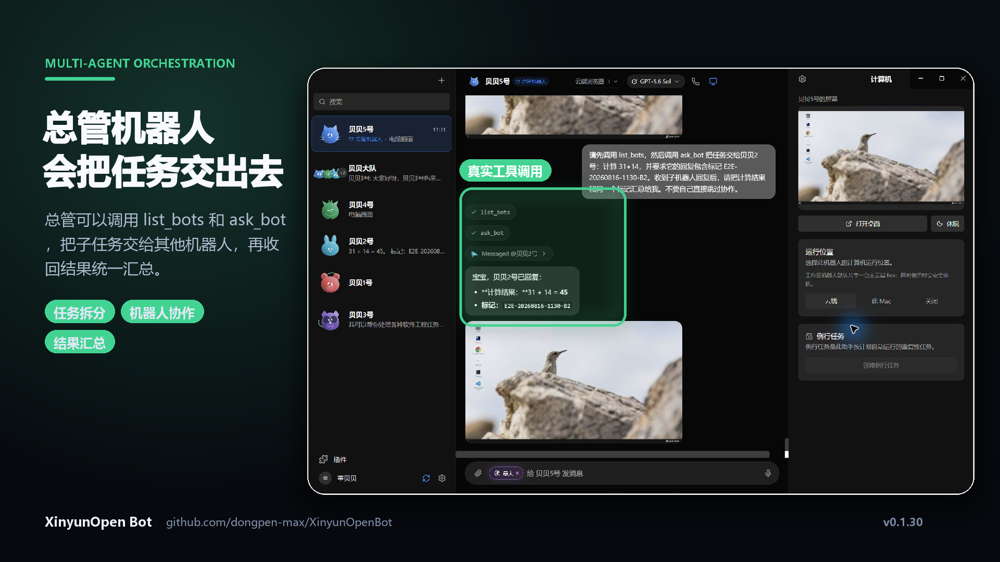
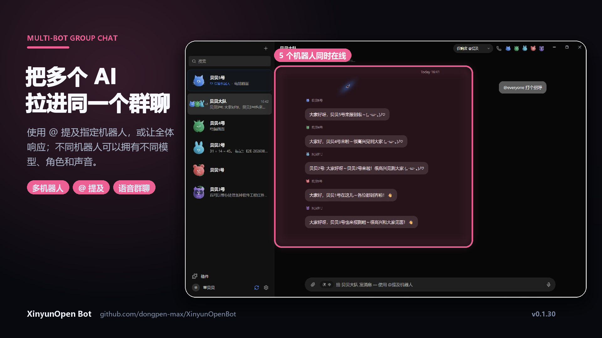
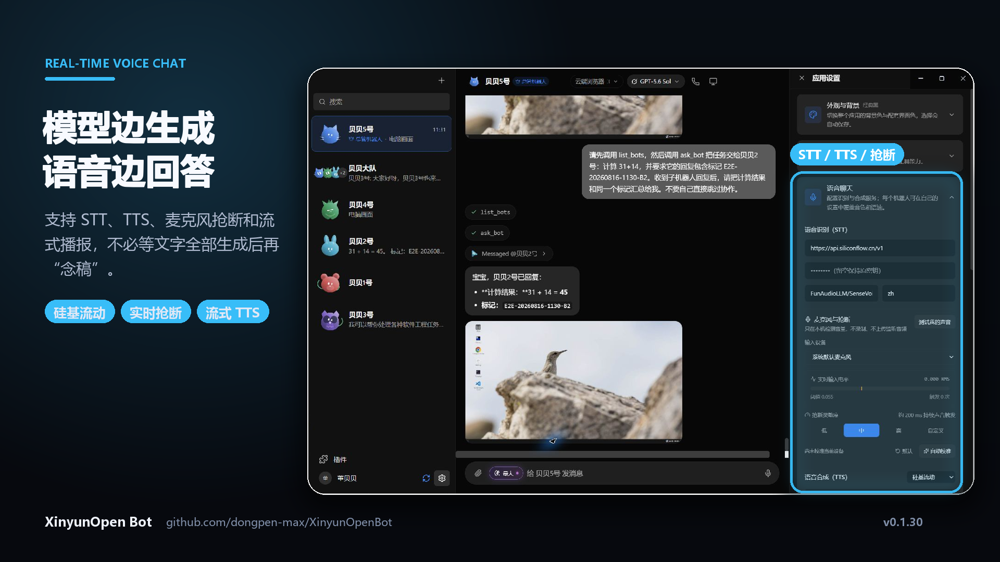
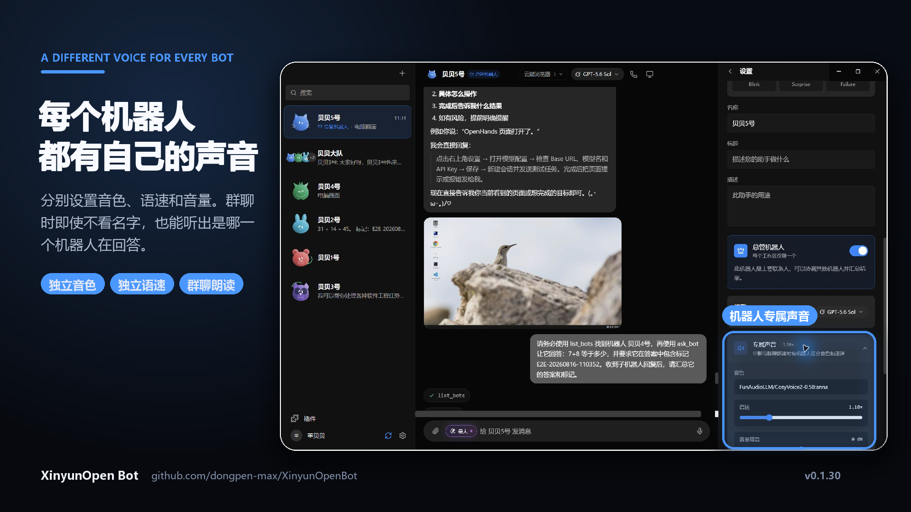
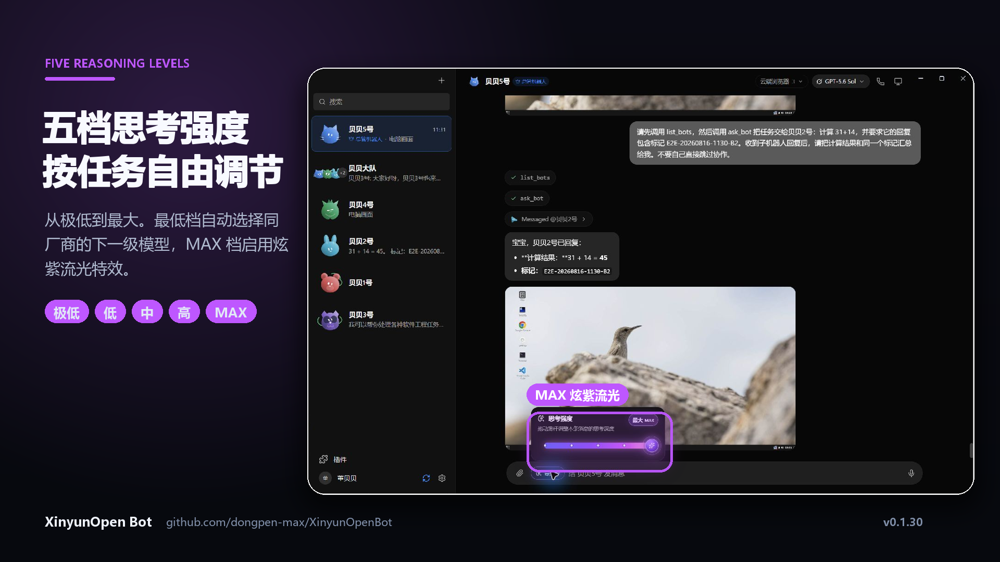
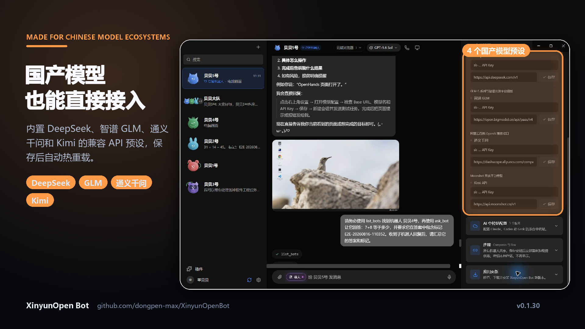

# XinyunOpen Bot

<p align="center">
  
</p>

**面向中国用户的开源 Grok Bot 平替方案，默认使用简体中文。**

XinyunOpen Bot 是一个基于 Electron、React 和 TypeScript 的桌面 AI 机器人管理工具。你可以像聊天联系人一样创建多个机器人，为每个机器人选择不同模型、独立任务和云端电脑，并在一个桌面应用里统一管理 Claude、Codex、GPT、Grok、Gemini 以及 OpenAI 兼容中转站模型。

> 本项目基于 [OpenMausBot](https://github.com/milind-soni/OpenMausBot) 开源项目开发，保留 MIT 许可证与原项目版权声明。XinyunOpen Bot 是独立社区项目，与 Grok Bot、xAI、OpenAI、Anthropic 或 Google 没有官方隶属关系。

## 下载

### Windows 10 / 11（x64）

- [下载最新版安装程序](https://github.com/dongpen-max/xinyunopenbot-releases/releases/latest/download/XinyunOpen-Bot-setup.exe)
- [查看全部版本](https://github.com/dongpen-max/xinyunopenbot-releases/releases)

安装包为按用户安装，不要求管理员权限。目前尚未购买 Windows 代码签名证书，首次运行时 Windows SmartScreen 可能显示“未知发布者”，可以选择“更多信息 → 仍要运行”。

### macOS

macOS 版本仍在整理发布流程。当前可从源码运行；后续安装包会发布到同一 Releases 页面。

## 为什么做 XinyunOpen Bot

Grok Bot 的“把 AI 当作聊天联系人管理”的产品形态很好用，但中国用户通常还需要：

- 默认简体中文界面；
- 支持国内可访问的 OpenAI 兼容中转站；
- 同时接入 GPT、Claude、Grok、Gemini、Qwen、DeepSeek 等模型；
- API 地址和模型目录可以自行配置；
- Windows 安装包和更适合国内网络的构建方式；
- 密钥、聊天记录和机器人状态保存在本机。

XinyunOpen Bot 保留多机器人聊天体验，并强化国内中转站、多模型和云电脑工具支持。

## 主要功能

- **多机器人管理**：每个机器人拥有独立名称、角色、模型、任务和对话历史。
- **多模型接入**：支持 Claude CLI、Codex CLI、Grok CLI、Gemini/Antigravity、xAI API 和 OpenAI-compatible API。
- **API 中转站**：支持自定义 Base URL、API Key，并可自动读取 `/v1/models` 模型列表。
- **默认简体中文**：首次启动、设置、聊天、错误提示和模型配置均以中文显示。
- **云端电脑**：机器人可以使用 Box 云桌面执行浏览器、Shell、截图、点击和输入操作。
- **本机电脑控制**：在支持的平台上可通过 CUA integration 操作本机桌面。
- **聊天房间**：多个机器人可以加入同一个房间，通过 @mention 协作。
- **总管机器人**：主要联系人可以调用 `list_bots` 与 `ask_bot`，向其他机器人分配任务并汇总结果。
- **五档思考强度**：支持极低、低、中、高、最大五档；极低档会自动选择同厂商的下一级模型。
- **对话分支**：编辑历史消息后生成新的对话分支。
- **实时语音聊天**：Windows、macOS 和 Linux 桌面端支持麦克风转写、流式回复播报、抢断及连续通话。
- **机器人专属声音**：每个机器人可独立设置音色、语速和音量，群聊朗读时自动区分发言者。
- **国产模型预设**：可直接配置 DeepSeek、智谱 GLM、通义千问和 Kimi 的兼容 API。
- **应用内更新**：从公开 Releases 仓库读取更新元数据并下载安装。
- **本地数据**：配置、聊天记录和事件日志默认保存在 `~/.openmausbot/`。

## 功能预览

<table>
  <tr>
    <td width="50%" valign="top">
      
      <br /><strong>Grok 4.6 / 4.5 直接接入</strong><br />
      通过兼容 API 使用 Grok，并保留云端电脑、工具调用和多机器人能力。
    </td>
    <td width="50%" valign="top">
      
      <br /><strong>总管机器人分配与汇总任务</strong><br />
      一个机器人负责沟通，其他机器人负责执行子任务。
    </td>
  </tr>
  <tr>
    <td width="50%" valign="top">
      
      <br /><strong>多机器人群聊</strong><br />
      使用 @ 提及指定机器人，不同成员可以拥有不同模型、角色与声音。
    </td>
    <td width="50%" valign="top">
      
      <br /><strong>边生成，边语音回答</strong><br />
      支持 STT、流式 TTS、麦克风抢断和连续语音通话。
    </td>
  </tr>
  <tr>
    <td width="50%" valign="top">
      
      <br /><strong>每个机器人都有自己的声音</strong><br />
      分别设置音色、语速和音量，让群聊中的角色更容易区分。
    </td>
    <td width="50%" valign="top">
      
      <br /><strong>五档思考强度</strong><br />
      简单问题快速回答，复杂任务可切换到炫紫 MAX 档。
    </td>
  </tr>
  <tr>
    <td colspan="2" align="center" valign="top">
      
      <br /><strong>国产模型直接接入</strong><br />
      内置 DeepSeek、智谱 GLM、通义千问和 Kimi 的兼容 API 预设。
    </td>
  </tr>
</table>

## 快速开始

### 使用安装包

1. 从 Releases 下载 `XinyunOpen-Bot-setup.exe`。
2. 运行安装程序并选择安装目录。
3. 打开 **XinyunOpen Bot**。
4. 在“应用设置”中配置模型或中转站。
5. 新建机器人并选择模型即可开始使用。

### 从源码运行

需要：

- Node.js 24 或更高版本
- pnpm 10
- Windows、macOS 或 Linux 开发环境

```bash
git clone https://github.com/dongpen-max/XinyunOpenBot.git
cd XinyunOpenBot
pnpm install
```

开发模式：

```bash
pnpm dev
pnpm dev:server
```

桌面模式：

```bash
pnpm dev:desktop
```

Windows 打包：

```powershell
$env:ELECTRON_MIRROR = "https://npmmirror.com/mirrors/electron/"
$env:ELECTRON_BUILDER_BINARIES_MIRROR = "https://npmmirror.com/mirrors/electron-builder-binaries/"
$env:CSC_IDENTITY_AUTO_DISCOVERY = "false"
pnpm package:win
```

## 中转站配置

在应用设置中填写：

- API Key
- Base URL，例如 `https://example.com/v1`
- 模型列表，或点击“获取模型”自动发现

当前支持 Anthropic、OpenAI、xAI 三类配置入口。OpenAI-compatible driver 可供 GPT、Grok、Claude、Qwen、DeepSeek 等兼容模型使用；对于支持 Anthropic 原生 `/messages` 的 Claude 中转站，也可以使用 Claude Agent driver。

## 语音聊天配置

在“应用设置 → 语音聊天”中分别配置兼容 OpenAI Audio API 的 STT 与 TTS 服务：

- STT Base URL、API Key、模型（默认 `whisper-1`）和语言（默认 `zh`）；
- TTS Base URL、API Key、模型（默认 `tts-1`）和声音（默认 `alloy`）；
- 可在应用内选择预置或自定义音色，并调整语速；硅基流动模式还支持音量增益和输出采样率；
- 每个机器人可在“机器人设置 → 专属声音”中覆盖音色、语速和音量，群聊消息朗读会按发言机器人自动选择声音；
- 可选“自动朗读新回复”。

应用会调用 `${Base URL}/audio/transcriptions` 识别录音，并调用 `${Base URL}/audio/speech` 合成回复。API Key 仅由本机 Harness 读取，不会回传到前端。配置完成后，可使用输入框麦克风按钮、机器人回复旁的朗读按钮，或聊天标题栏的电话按钮。

应用设置采用单板块展开方式，外观、AI 引擎、语音、中转站和连接配置可按需展开，避免右侧设置面板过长。

详细说明：

- [API 配置说明](./API配置说明.md)
- [使用指南](./使用指南.md)

## 数据与隐私

默认本地数据目录：

```text
~/.openmausbot/
```

其中可能包含：

- `config.json`：应用配置和 API Key
- 机器人及任务状态
- 对话记录
- provider 事件日志

这些文件不会被提交到 Git。请勿把 `.env.local`、个人 `config.json` 或日志中的密钥上传到公开仓库。

## 技术栈

- Electron
- React 19
- TypeScript
- Vite
- Tailwind CSS
- Node.js HTTP Server
- Vitest
- electron-builder

## 开发检查

```bash
pnpm test
pnpm typecheck
pnpm build
```

## 项目结构

```text
src/                 React 前端
server/              Node.js 后端与 provider drivers
electron/            Electron 主进程、preload 和自动更新
build/               应用图标与打包资源
scripts/             构建、检查和发布脚本
docs/                技术文档和截图
```

## 路线图

- 云端 Box 主实例与任务租约策略
- 更多国内模型预设
- macOS 安装包与签名发布
- Windows 代码签名
- 中转站健康检查和模型自动刷新
- 模型切换与 provider 状态界面优化

## 贡献

欢迎提交 Issue 和 Pull Request。提交前请运行：

```bash
pnpm test
pnpm typecheck
```

## 许可证

[MIT License](./LICENSE)

Copyright © 2026 Milind Soni、OpenMausBot contributors 与 XinyunOpen Bot contributors。
